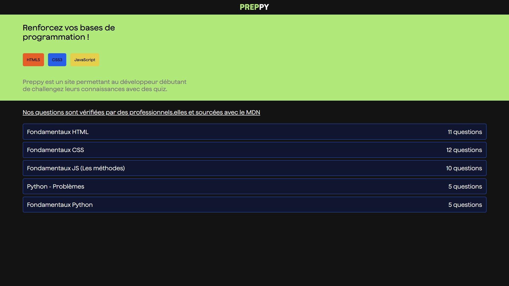

# Preppy

The goal is to create a quiz application that displays a score at the end of each quiz.

## Users should be able to

- See all quizzes available
- Answer the questions one by one and see a source and an explanation when answered
- See their score at the end of the quiz as a percentage

## Stack

- HTML5
- CSS3
- TypeScript
- Angular
- Jasmine

## Screenshot

## Resources

- [Angular Documentation](https://angular.io/guide/component-overview)
- [Jasmine Documentation](https://jasmine.github.io/pages/docs_home.html)
- [Deborah Kurata's Channel](https://www.youtube.com/@deborah_kurata)
